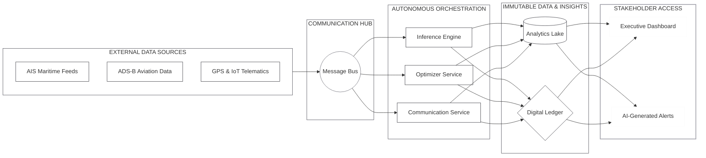

# SmartChain — AI Supply Chain Control Tower

SmartChain is an enterprise-grade logistics command center designed for real-time visibility and predictive risk management. It utilizes a **Dual-Engine Architecture** to balance rapid I/O with heavy-lifting AI logic.


##  System Architecture

SmartChain utilizes a high-performance, event-driven architecture. The pipeline is designed for "Zero-Trust" data integrity and autonomous decision-making.



  ---

SmartChain separates **Live Operations** from **Intelligence** to ensure sub-second UI updates without blocking the main thread.

| Component | Responsibility | Tech Stack |
| :--- | :--- | :--- |
| **Live Engine** | Real-time movement, geofencing, and WebSocket streaming. | Node.js, Express, Socket.IO |
| **AI Brain** | Risk assessment, NLP chat, and disruption simulations. | Python FastAPI, Gemini 1.5 Flash |
| **Persistence** | Flexible document storage with in-memory fallback. | MongoDB, Mongoose |
| **Command Center** | High-performance dashboard with 60FPS map rendering. | React, Vite, Tailwind CSS |

---

##  Risk Modeling & Simulation

SmartChain doesn't just display data; it predicts disruption. The **Risk Score ($R$)** is calculated every tick using a weighted algorithm:

$$R = (w_1 \cdot \Delta v) + (w_2 \cdot \sigma_T) + (w_3 \cdot D)$$

* **$\Delta v$**: Speed deviation from the route average.
* **$\sigma_T$**: Temperature variance (critical for cold-chain integrity).
* **$D$**: External disruption factor (Storm, Strike, Traffic) provided by the AI Service.

### Simulation Flow
1. **Trigger**: User initiates a "Storm" event via the Dashboard.
2. **Analysis**: Python FastAPI processes current shipment coordinates against the disruption radius.
3. **Execution**: Node.js updates the `effectiveSpeed` and `riskScore` in the runtime state.
4. **Broadcast**: Socket.IO pushes the update to all clients in **<100ms**.

---

##  Tech Stack & Features

### Core Technologies
* **Frontend**: React 18, Vite, Tailwind CSS, Lucide Icons.
* **Backend**: Node.js (Movement Engine), FastAPI (AI Service).
* **Real-time**: Socket.IO for live truck interpolation and heading calculation.
* **Maps**: Google Maps JS API with custom SVG truck rotations.

### Key Features
* **Live Movement Engine**: Trucks interpolate between waypoints with real-time ETA decay.
* **AI Copilot**: Natural language interface to query shipment health ("Which truck is at risk?").
* **Dynamic Rerouting**: One-click intervention to move shipments to safer paths.
* **Geofencing**: Automatic event logging when trucks enter/exit key logistics hubs.

---

##  Project Structure
```text
smartchain/
├── ai-service/         # Python FastAPI: Risk Models & Gemini LLM
├── backend/            # Node.js: Movement Engine & WebSocket Server
├── frontend/           # React: Dashboard & Live Map UI
└── sample-import.csv   # Data for bulk ingest testing

```

---

##  Quick Start

### 1. AI Service (Python)
```bash
cd ai-service
pip install -r requirements.txt
# Add GEMINI_API_KEY to .env
uvicorn main:app --reload --port 8001

```


### 2. Backend
```bash

cd backend
npm install
npm run dev 

```
### 3. Frontend
```bash

cd frontend
npm install
npm run dev # Runs on port 5173

```


##  Reliability & Fallbacks

SmartChain is engineered for high availability during live demos, featuring three distinct layers of redundancy:

* **Database Fallback**: If a MongoDB instance is not detected, the system automatically initializes an **In-Memory State** using seeded data, ensuring zero-configuration startups.
* **AI Fallback**: If the Python FastAPI service or Gemini API is unreachable, the Node.js backend seamlessly reverts to **Rule-Based Logic** for simulations and chat responses.
* **Connection Fallback**: If WebSockets (Socket.IO) are blocked by restricted networks, the frontend automatically switches to **HTTP Long-Polling** to maintain the real-time data stream.

## 📊 API Summary

| Endpoint | Method | Function |
| :--- | :--- | :--- |
| `/shipments` | `GET` | Fetch all active live shipment states. |
| `/simulate` | `POST` | Inject disruptions (storm, traffic, strike) into the engine. |
| `/chat` | `POST` | Proxy natural language queries to Gemini 1.5 Flash. |
| `/telemetry/summary` | `GET` | Retrieve historical tick data for real-time analytics charts. |


---

---

##  Future Vision: The Autonomous Supply Chain

SmartChain is not just a dashboard; it is the first step toward a **Self-Healing Logistics Network**. Our vision for 2.0 includes:

###  Satellite-to-Edge Intelligence
Integrating **Starlink-based IoT** connectivity to maintain real-time telemetry in "dead zones," moving geofence logic from the server to the vehicle's edge for sub-millisecond response times.

###  Autonomous Orchestration
Moving beyond "AI Chat" to **AI Action**. In future builds, the system won't just suggest a reroute—it will autonomously negotiate with freight brokers to secure alternative capacity during a storm event before the human operator even sees the alert.

###  Cold-Chain Digital Twins
Leveraging Python's ML ecosystem to create a **Thermal Digital Twin** for every shipment. This would allow us to predict the internal spoilage rate of perishable goods based on external weather patterns and truck vibration data.


---


